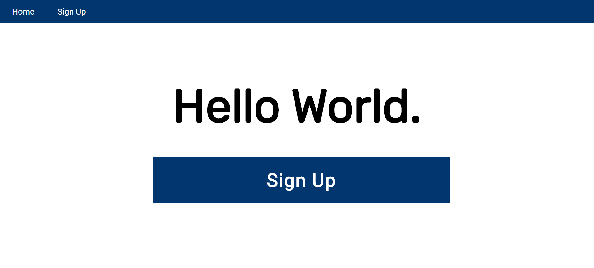
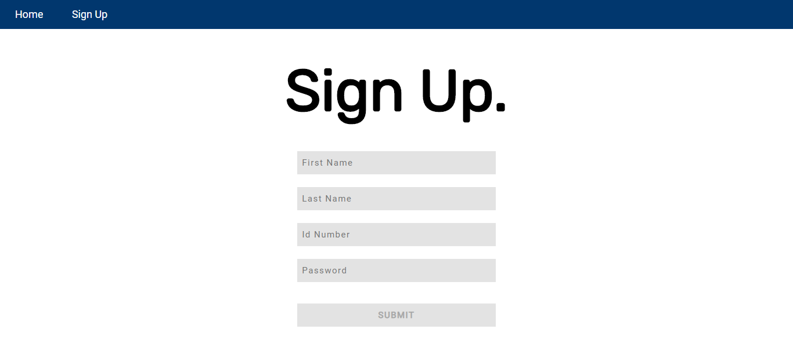
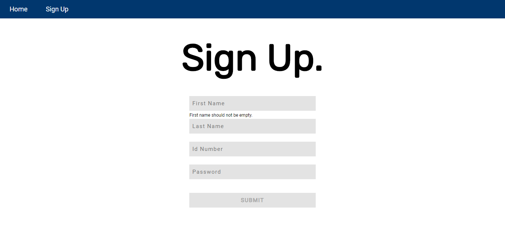

# ccapdev-validation
Express-Validator Tutorial for CCAPDEV1920T2

This repository will help you integrate client-side and server-side validation to your web applications using [validator.js](https://github.com/validatorjs/validator.js) and [express-validator](https://express-validator.github.io/docs/). This web application is based on the previous [repository on ajax tutorial](https://github.com/arvention/ccapdev-ajax). For this tutorial, we will use these libraries to validate the user input in the sign-up form, both in the client-side and the server-side, before storing the values in the database.

## Contents:

Each folder and file in this repository is properly documented. You may read the `README.md` file of each folder to understand its content. You may also read the inline comments of each file explaining the statements line-per-line.

- [controllers](controllers) - This folder contains files which defines callback functions for client requests.
- [helpers](helpers) - This folder contains files which contains helper functions.
- [models](models) - This folder contains files for database modeling and access.
- [public](public) - This folder contains static assets such as css, js, and image files.
- [routes](routes) - This folder contains files which describes the response of the server for each HTTP method request to a specific path in the server.
- [views](views) - This folder contains all hbs files to be rendered when requested from the server.
- [index.js](index.js) - The main entry point of the web application.

## Follow the steps below to set-up and study this repository:
1. Clone the repository either by downloading the contents of the repository [here](https://github.com/arvention/ccapdev-validation/archive/master.zip), or using the command below (Note: git should be installed in your system for this to work).
```
git clone https://github.com/arvention/ccapdev-validation
```
2. Open Command Prompt
3. Navigate to the project folder - the folder containing the contents of the cloned or downloaded repository.
4. Run the command `npm install` to initialize and install all necessary modules used in the project.

5. We may now run our server. To do this, we run the command `node index.js`. Upon running the command, your Command Prompt should display the following statement:
```
app listening at port 9090
Connected to: mongodb://localhost:27017/ccapdev-validation
```

6. Let's test our web application. Go to the link below to access the web application:
```
http://localhost:9090/
```

Your web browser should display the screen below:


7. Go to the sign-up page either using the menu item or the button.

The picture below shows a blank sign-up form.


Review the file [`views/signup.hbs`](views/signup.hbs), focus on the `<form>` element, and take note of its elements and their attributes. Shown below is the `<form>` as excerpted from the file:

```
<form id="signup" method="post">
    <input type="text" name="fName" id="fName" class="field" placeholder="First Name" required> <br>
    <p id="fNameError" class="error">{{fNameError}}</p>
    <input type="text" name="lName" id="lName" class="field" placeholder="Last Name" required> <br>
    <p id="lNameError" class="error">{{lNameError}}</p>
    <input type="number" name="idNum" id="idNum" class="field" placeholder="Id Number" required> <br>
    <p id="idNumError" class="error">{{idNumError}}</p>
    <input type="password" name="pw" id="pw" class="field" placeholder="Password" required> <br>
    <p id="pwError" class="error">{{pwError}}</p>
    <input type="submit" id="submit" value="SUBMIT" disabled>
 </form>
```

We'll first discuss the client-side validation. For the client-side validation, we will use [validator.js](https://github.com/validatorjs/validator.js). We will use this to validate and sanitize the user input in the client-side. Client-side validation means that we will not send any HTTP request to the server to validate the values entered by the user.

For the sign-up sheet in [`views/signup.hbs`](views/signup.hbs), we will:
- Check if the value entered by the user for the field `fName` is not an empty string.
- Check if the value entered by the user for the field `lName` is not an empty string.
- Check if the value entered by the user for the field `idNum` contains EXACTLY 8 digits.
- Check if the value entered by the user for the field `pw` contains AT LEAST 8 characters.

Make sure that JavaScript is allowed in your web browser. Try typing some values in each field to check if the client side validation works. For the field `fName`, try entering a blank space, or try entering a character and deleting it. A message should display below the field which says `First name should not be empty`.

The picture below shows the error message displayed when the user enters an empty string for the field `fName`.

