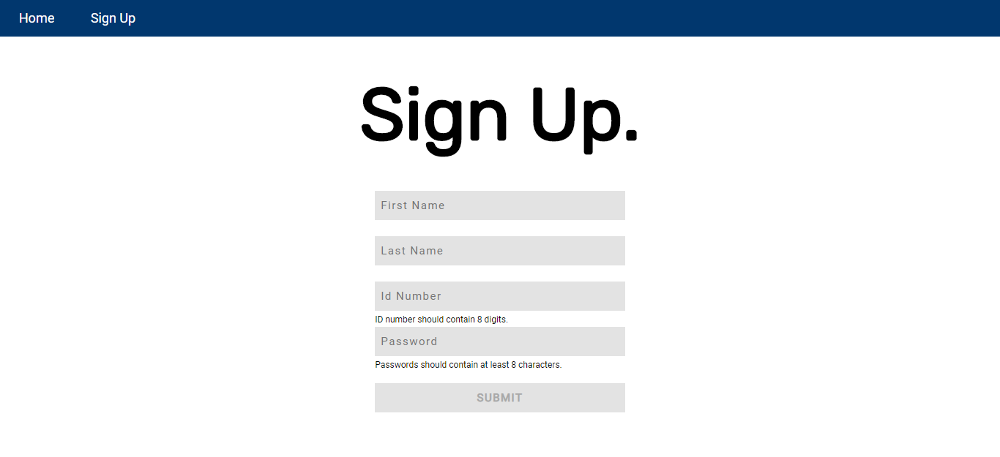

# ccapdev-validation
Express-Validator Tutorial for CCAPDEV1920T2

This repository will help you integrate client-side and server-side validation to your web applications using [validator.js](https://github.com/validatorjs/validator.js) and [express-validator](https://express-validator.github.io/docs/). This web application is based on the previous [repository on ajax tutorial](https://github.com/arvention/ccapdev-ajax). For this tutorial, we will use these libraries to validate the user input in the sign-up form, both in the client-side and the server-side, before storing the values in the database.

## Contents:

Each folder and file in this repository is properly documented. You may read the `README.md` file of each folder to understand its content. You may also read the inline comments of each file explaining the statements line-per-line.

- [controllers](controllers) - This folder contains files which defines callback functions for client requests.
- [helpers](helpers) - This folder contains files which contains helper functions.
- [models](models) - This folder contains files for database modeling and access.
- [public](public) - This folder contains static assets such as css, js, and image files.
- [routes](routes) - This folder contains files which describes the response of the server for each HTTP method request to a specific path in the server.
- [views](views) - This folder contains all hbs files to be rendered when requested from the server.
- [index.js](index.js) - The main entry point of the web application.

## Follow the steps below to set-up and study this repository:
1. Clone the repository either by downloading the contents of the repository [here](https://github.com/arvention/ccapdev-validation/archive/master.zip), or using the command below (Note: git should be installed in your system for this to work).
```
git clone https://github.com/arvention/ccapdev-validation
```
2. Open Command Prompt
3. Navigate to the project folder - the folder containing the contents of the cloned or downloaded repository.
4. Run the command `npm install` to initialize and install all necessary modules used in the project.

5. We may now run our server. To do this, we run the command `node index.js`. Upon running the command, your Command Prompt should display the following statement:
```
app listening at port 9090
Connected to: mongodb://localhost:27017/ccapdev-validation
```

6. Let's test our web application. Go to the link below to access the web application:
```
http://localhost:9090/
```

Your web browser should display the screen below:


7. Go to the sign-up page either using the menu item or the button.

The picture below shows a blank sign-up form.


Review the file [`views/signup.hbs`](views/signup.hbs), focus on the `<form>` element, and take note of its elements and their attributes. Shown below is the `<form>` as excerpted from the file:

```
<form id="signup" method="post">
    <input type="text" name="fName" id="fName" class="field" placeholder="First Name" required> <br>
    <p id="fNameError" class="error">{{fNameError}}</p>

    <input type="text" name="lName" id="lName" class="field" placeholder="Last Name" required> <br>
    <p id="lNameError" class="error">{{lNameError}}</p>

    <input type="number" name="idNum" id="idNum" class="field" placeholder="Id Number" required> <br>
    <p id="idNumError" class="error">{{idNumError}}</p>

    <input type="password" name="pw" id="pw" class="field" placeholder="Password" required> <br>
    <p id="pwError" class="error">{{pwError}}</p>

    <input type="submit" id="submit" value="SUBMIT" disabled>
 </form>
```

We'll first discuss the client-side validation. For the client-side validation, we will use [validator.js](https://github.com/validatorjs/validator.js). We will use this to validate and sanitize the user input in the client-side. Client-side validation means that we will not send any HTTP request to the server to validate the values entered by the user.

For the sign-up sheet in [`views/signup.hbs`](views/signup.hbs), we will:
- Check if the value entered by the user for the `<input>` field `fName` is not an empty string.
- Check if the value entered by the user for the `<input>` field `lName` is not an empty string.
- Check if the value entered by the user for the `<input>` field `idNum` contains EXACTLY 8 digits.
- Check if the value entered by the user for the `<input>` field `pw` contains AT LEAST 8 characters.

Make sure that JavaScript is allowed in your web browser. Try typing some values in each `<input>` field to check if the client side validation works. For the `<input>` field `fName`, try entering a blank space, or try entering a character and deleting it. A message should display below the `<input>` field which says `First name should not be empty`.

The picture below shows the error message displayed when the user enters an empty string for the `<input>` field `fName`.


Try to check the client-side validation of the other `<input>` fields. For `<input>` field `idNum`, every time the user enters a digit in the `<input>` field, the client-side script will check if the user has entered EXACTLY 8 digits. For `<input>` field `pw`, every time the user enters a character in the `<input>` field, the client-side script will check if the user has entered AT LEAST 8 characters.

The client-side script [`public/js/signup.js`](public/js/signup.js) is attached to [`views/signup.hbs`](views/signup.hbs). This script contains lines of code which attaches a `keyup()` event all `<input>` element. We will discuss all the functions in the script.

Function `isFilled()` returns true if all the `<input>` fields are not empty, otherwise it returns false. This function uses functions defined in [validator.js](https://github.com/validatorjs/validator.js). The function call `validator.trim()` removes all leading and trailing blank spaces entered by the user. The function call `validator.isEmpty()` returns true if the string argument is empty, otherwise, returns false. Shown below is the code as excerpted from the file:

```
function isFilled() {

    var fName = validator.trim($('#fName').val());
    var lName = validator.trim($('#lName').val());
    var idNum = validator.trim($('#idNum').val());
    var pw = validator.trim($('#pw').val());

    var fNameEmpty = validator.isEmpty(fName);
    var lNameEmpty = validator.isEmpty(lName);
    var idNumEmpty = validator.isEmpty(idNum);
    var pwEmpty = validator.isEmpty(pw);

    return !fNameEmpty && !lNameEmpty && !idNumEmpty && !pwEmpty;
}
```

Function `isValidID()` returns true if the `<input>` field `idNum` contains EXACTLY 8 digits, otherwise it returns false. This function uses functions defined in [validator.js](https://github.com/validatorjs/validator.js). The function call `validator.isLength()` checks if the number of characters in the string is within the defined range. The function call `validator.isLength()` accepts an object with 2 fields, min (defines the minimum number of characters in the string) and max (defines the maximum number of characters in the string).

The function `isValidID()` accepts two parameters - `field` (which is the current `<input>` field calling the function) and `callback` (which is the function called after the execution of `isValidID()`).

The function `isValidID()` is not entirely a client-side validation since it also integrates an AJAX call to check if the ID number entered by the user is unique from the ID numbers already stored in the database. The function displays appropriate error messages for all scenarios. Shown below is the code as excerpted from the file:
```
function isValidID(field, callback) {

    var idNum = validator.trim($('#idNum').val());
    var isValidLength = validator.isLength(idNum, {min: 8, max: 8});

    if(isValidLength) {
        $.get('/getCheckID', {idNum: idNum}, function (result) {
            if(result.idNum != idNum) {
                if(field.is($('#idNum')))
                    $('#idNumError').text('');

                return callback(true);

            }

            else {
                if(field.is($('#idNum')))
                    $('#idNumError').text('ID number already registered.');
                    return callback(false);
                }
            });
        }

    else {
        if(field.is($('#idNum')))
            $('#idNumError').text('ID Number should contain 8 digits.');
            return callback(false);
    }
}
```

Function `isValidPassword()` returns true if the `<input>` field `pw` contains AT LEAST 8 characters, otherwise it returns false. This function uses functions defined in [validator.js](https://github.com/validatorjs/validator.js). The function call `validator.isLength()` checks if the number of characters in the string is within the defined range. The function call `validator.isLength()` accepts an object with 2 fields, min (defines the minimum number of characters in the string) and max (defines the maximum number of characters in the string).

The function `isValidPassword()` accepts the parameter `field`, which is the current `<input>` field calling the function. The function displays appropriate error messages for all scenarios. Shown below is the code as excerpted from the file:

```
function isValidPassword(field) {

    var validPassword = false;

    var password = validator.trim($('#pw').val());
    var isValidLength = validator.isLength(password, {min: 8});

    if(isValidLength) {
        if(field.is($('#pw')))
            $('#pwError').text('');
        validPassword = true;
    }

    else {
        if(field.is($('#pw')))
            $('#pwError').text(`Passwords should contain at least 8 characters.`);
    }

    return validPassword;
}
```
Function `validateField()` calls all the functions that we have defined before - `isFilled()`, `isValidID()`, and `isValidPassword()`. This function checks toggles the `disabled` property of `submit` button upon checking if (1) all `<input>` fields are not empty, (2) the value entered by the user in `<input>` field `idNum` contains EXACTLY 8 digits, and the value entered by the user in `<input>` field `pw` contains AT LEAST 8 characters. If all functions - `isFilled()`, `isValidID()`, and `isValidPassword()` - return true, then the `submit` button will be enabled. If one of the `<input>` fields failed the validation, then the `submit` button will be disabled.

Function `validateField` accepts three parameters - `field` (which is the current `<input>` field calling the function), `fieldName` (which is the the `placeholder` of the current `<input>` field calling the function), and `error` (which is the corresponding `<p>` element to display the error of the current `<input>` field calling this function). Shown below is the code as excerpted from the file:

```
function validateField(field, fieldName, error) {

    var value = validator.trim(field.val());
    var empty = validator.isEmpty(value);

    if(empty) {
        field.prop('value', '');
        error.text(fieldName + ' should not be empty.');
    }

    else
        error.text('');

    var filled = isFilled();
    var validPassword = isValidPassword(field);
    isValidID(field, function (validID) {

        if(filled && validPassword && validID)
            $('#submit').prop('disabled', false);

        else
            $('#submit').prop('disabled', true);
    });
}
```
This script also contains lines of code which attaches a `keyup()` event to each `<input>` element. The function attached to this event is executed every time the user enters a character in the `<input>` field. Each `<input>` field calls the `validateField()` function. Shown below is the code as excerpted from the file:

```
$('#fName').keyup(function () {
    validateField($('#fName'), 'First name', $('#fNameError'));
});

$('#lName').keyup(function () {
    validateField($('#lName'), 'Last name', $('#lNameError'));
});

$('#idNum').keyup(function () {
    validateField($('#idNum'), 'ID Number', $('#idNumError'));
});

$('#pw').keyup(function () {
    validateField($('#pw'), 'Password', $('#pwError'));
});
```

8. Now, let's discuss server-side validation. We implement the same form validation in the server-side. This is useful for instances where the client's machine disabled the execution of JavaScript. In this case, the values entered by the user will be checked after the user has submitted the values in the form to the server.

To demonstrate the use of server-side validation, you must first disable JavaScript in your browser. Disabling the JavaScript in the browser means that our client-side script will not execute. If you are using Google Chrome, you may disable JavaScript through Settings > Privacy and security > Site Settings > JavaScript.

After disabling JavaScript in your code, go to [`views/signup.hbs`](views/signup.hbs) and remove the `disabled` attribute in the `submit` button. Now, try entering invalid values to the sign-up form - value which contains less than or more than 8 digits for `idNum` or value which contains less than 8 characters for `pw`. Notice that no error message is displayed even if we have entered invalid values. Try to submit the form. The web application should redirect you to the sign-up form with corresponding error messages for the `<input>` fields `idNum` and `pw`.

The picture below shows the error message displayed when the user enters invalid values for the `<input>` fields `idNum` and `pw`.


The server-side validation is implemented using express middlewares defined in [express-validator](https://express-validator.github.io/docs/). This module wraps functions that are defined in [validator.js](https://github.com/validatorjs/validator.js) to express middlewares to be used in server-side scripting.

We define the function `sigupValidation()` which returns an array of middleware functions in the `validation` object of [`helpers/validation.js`](helpers/validation.js). Shown below is the code as excerpted from the file:

```
signupValidation: function () {

    var validation = [
        check('fName', 'First name should not be empty.').notEmpty(),
        check('lName', 'Last name should not be empty.').notEmpty(),
        check('idNum', 'ID number should contain 8 digits.').isLength({min: 8, max: 8}),
        check('pw', 'Passwords should contain at least 8 characters.').isLength({min: 8})
    ];

    return validation;
}
```

The `check()` function is defined in [express-validator](https://express-validator.github.io/docs/). The first parameter of the function `check()` is the field to check, while its second parameter is the error message returned if the validation results to an error - i.e., the value entered by the user for the parameter does not satisfy the validation rules set for that `<input>` field.

The function `sigupValidation()` is called to return an array of validation middlewares which is executed when the client sends an HTTP POST request to the path `/signup`, as defined in [`routes/routes.js`](routes/routes.js). Shown below is the code as excerpted from the file:

```
app.post('/signup', validation.signupValidation(), signupController.postSignUp);
```

The array of middleware functions in the function `signupValidation()` will be executed before the callback function `postSignUp()`. The callback function `postSignUp()`, defined in [`controllers/signupController.js`](controllers/signupController.js) then checks for errors from the middleware validation functions. Shown below is the code as excerpted from the file:

```
postSignUp: function (req, res) {

    var errors = validationResult(req);

    if (!errors.isEmpty()) {
        errors = errors.errors;

        var details = {};
        for(i = 0; i < errors.length; i++)
            details[errors[i].param + 'Error'] = errors[i].msg;

        res.render('signup', details);
    }

    else {
        var fName = req.body.fName;
        var lName = req.body.lName;
        var idNum = req.body.idNum;
        var pw = req.body.pw;

        var user = {
            fName: fName,
            lName: lName,
            idNum: idNum,
            pw: pw
        }

        db.insertOne(User, user, function(flag) {
            if(flag) {
                res.redirect('/success?fName=' + fName +'&lName=' + lName + '&idNum=' + idNum);
            }
        });
    }
}
```

9. Read the rest of the documentation in the `README.md` files in each folder and in the in-line comments in each file :sunglasses:
